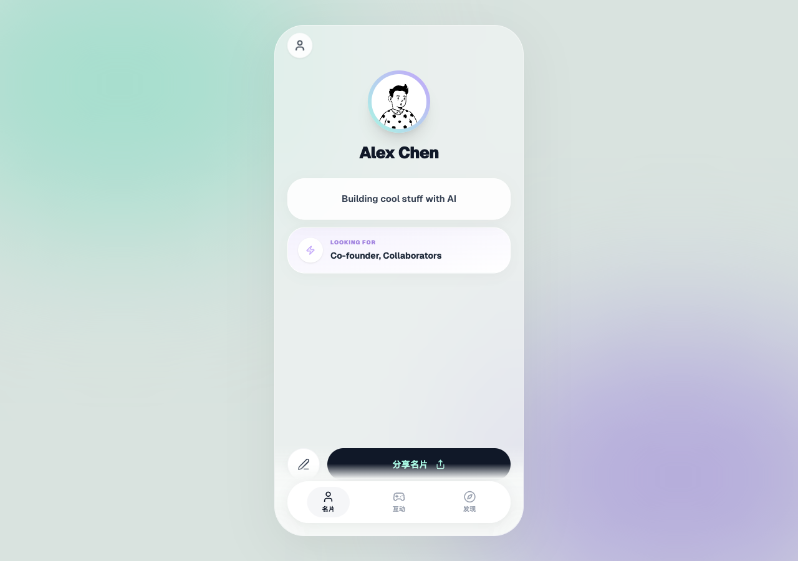
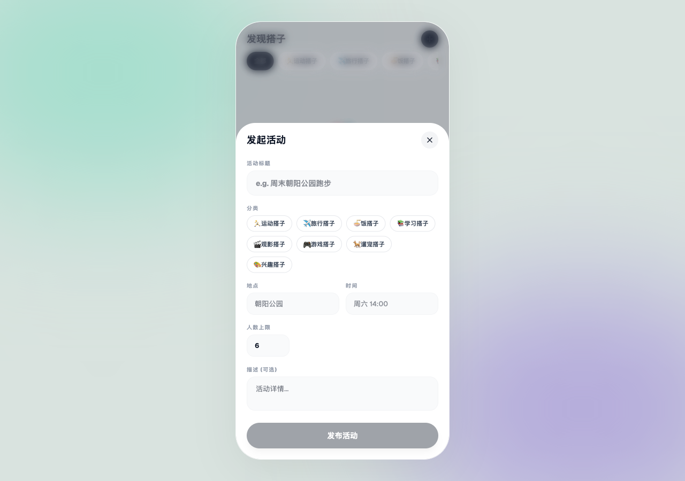

<div align="center">

# DappCard
> Your Social Identity Card + Companion Discovery Platform · 你的社交身份名片 + 搭子发现平台



### One Card, Infinite Connections


[Features](#-features) · [Screenshots](#-screenshots) · [Quick Start](#-quick-start) · [Architecture](#-architecture)

[简体中文](./README.md) | __English__

---
</div>

## Introduction

DappCard is a social app that combines **digital identity cards**, **social icebreaker card games**, and **companion activity discovery**. Whether you want to quickly present yourself at events, break the ice with fun questions, or find like-minded activity partners, DappCard makes it effortless.

### Why Choose DappCard?

| Traditional Way | DappCard |
|----------------|----------|
| Scattered info, hard to remember | Beautiful digital card, one-tap share |
| Awkward social openings, nothing to say | 80+ professional icebreaker cards, natural conversation starters |
| Want to find activity buddies, don't know where | 8 categories of companion discovery, quickly create or join |

## Features

### 1. Card — Your Digital Identity

Create a stunning personal card with avatar, bio, tags, verified social accounts, and highlights. Share instantly to X, Telegram, Discord, Line, and more.

- **3-Step Quick Setup**: Enter name → Write bio → Pick tags
- **Rich Tag System**: 12 identity tags including Builder, Designer, Founder, Developer
- **Social Verification**: Wallet address verification for credibility
- **Say Hi**: Send quick greeting messages


### 2. Games — Social Icebreaker Cards

Curated 80+ high-quality social icebreaker cards based on Arthur Aron's 36 Questions, Gottman Institute research, Proust Questionnaire, and more.

- **6 Preset Scenarios**: First Date, Late Night Talk, Party Game, Couple Chat, Self Discovery, Relationship Refresh
- **Multi-dimensional Tag Filtering**: Filter by source, game type, depth, and topic
- **Smart Deduplication**: Drawn cards won't repeat until reset
- **Favorites System**: Save cards you love for quick access
- **History Tracking**: View played cards and favorites


### 3. Discover — Companion Activities

Discover various activity partners around you, from sports and travel to dining and study — 8 categories covering all social scenarios.

- **8 Activity Categories**: Sports, Travel, Dining, Study, Movies, Gaming, Pets, Hobbies
- **Quick Activity Creation**: Fill in title, category, location, time, and max participants
- **One-Tap Join/Leave**: Join interesting activities with a single click
- **Local Persistence**: All activity data is stored locally and survives page refreshes




## Screenshots

| Profile Card | Games | Discover |
|-------------|-------|----------|
|  |  |  |

| Card Draw | Create Activity |
|-----------|----------------|
|  |  |

## Quick Start

### Requirements

- Node.js 18+
- npm 9+

### Installation & Run

```bash
# Clone the repository
git clone https://github.com/frankfika/DappCard.git
cd DappCard

# Install dependencies
npm install

# Start development server
npm run dev
```

The app will be available at http://localhost:3000.

### Build for Production

```bash
npm run build
```

Build output is located in `packages/web/dist/`.

## Architecture

```
DappCard/
├── packages/
│   ├── web/           # Web app (React + Vite + Tailwind CSS)
│   ├── shared/        # Shared library (card data, tags, type definitions)
│   └── miniprogram/   # WeChat Mini Program
├── docs/              # Documentation & screenshots
└── scripts/           # Utility scripts
```

### Tech Stack

| Layer | Technology |
|-------|------------|
| Frontend Framework | React 19 + TypeScript |
| Build Tool | Vite 6 |
| Styling | Tailwind CSS 4 + shadcn/ui |
| Animation | Motion (Framer Motion) |
| State Management | React Hooks + localStorage |
| Icons | Lucide React |

## Project Structure

```
packages/web/src/
├── App.tsx              # Main app component, tab bar routing
├── pages/
│   ├── CardPage.tsx     # Card page (onboarding + profile + edit)
│   ├── GamesPage.tsx    # Games page (presets + draw + history)
│   └── DiscoverPage.tsx # Discover page (categories + activities + create)
├── store.ts             # localStorage state management
└── main.tsx             # App entry point
```

## Data Persistence

DappCard uses browser localStorage for data persistence:

- `dappcard_profile` — User profile information
- `dappcard_tab` — Currently selected tab
- `dappcard_game_session` — Game history and favorites
- `dappcard_activities` — Activity list

## Contributing

Issues and Pull Requests are welcome!

1. Fork this repository
2. Create a feature branch (`git checkout -b feature/AmazingFeature`)
3. Commit your changes (`git commit -m 'Add some AmazingFeature'`)
4. Push to the branch (`git push origin feature/AmazingFeature`)
5. Open a Pull Request

## License

This project is open-sourced under the [MIT](LICENSE) License.

---

<div align="center">

**Made with 💚 by DappCard Team**

</div>
